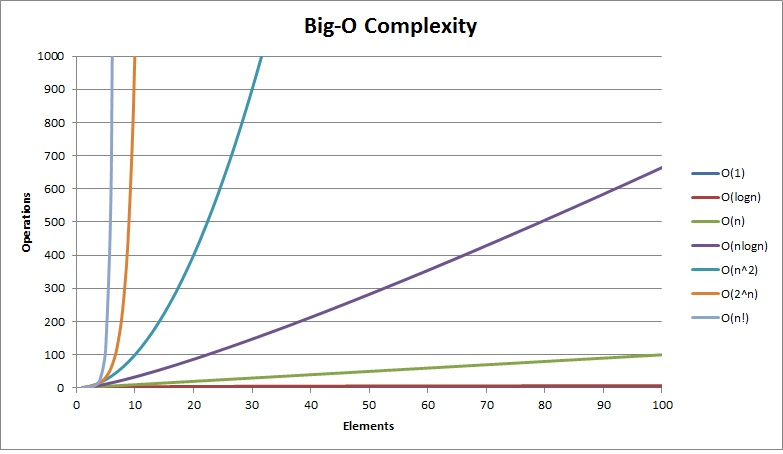

#  😎 Data Structures and Algorithim's 

I've had my fair share of failures in coding interviews, so I've put together a guide on Data Structures and Algorithms. I hope this resource will help you out and inspire you to dive deeper into this subject! There are plenty of excellent **FREE** courses available on DSA, and one that I've been particularly enjoying is [this one](https://frontendmasters.com/courses/algorithms/).


# What is Big O? 🤷

Big O is a way to categorize your algorithms' time or memory requirements based on input. It is not meant to be an exact measurement; it will not tell you how many CPU cycles it takes. Instead, it is meant to generalize the growth of your algorithm.

## <u>**Another way to explain it...**</u>

Big O is a way to group or classify your algorithms based on how much time or memory they need as the problem gets bigger. It doesn't tell you the exact number of computer steps it takes, but it helps us understand how the algorithm's performance changes as the problem gets larger."

**or**

As your input grows, how fast does computation or memory grow?

#### <u>Example (which will make sense soon)</u>

You may hear someone say **"O of N,"** which means your algorithm will grow linearly based on input. 

## <u>**Why do we use it?**</u>

It will help us make decisions about what data structures and algorithms to use. Knowing how they will perform can greatly help create *the best* possible program out there.

<br>

## **<u>Looking at input. How does our program's execution time grow with respect to input?</u>**

<br>

```typescript
function sumCharCodes(n: string) : number {
    let sum = 0;
    for (let i = 0; i < n.length; ++i) {
        sum += n.charCodeAt(i)
    }
    
    return sum;
}
```

In this example n is a string meaning it has a length and a series of characters. 

Looking at the **for loop** you can see that it has to execute the length of the string. Meaning that if the string grows by 50% our function is 50% slower **(it grows linearily)**. For every one more unit of string there is one more loop it has to do. 

**<u>ANSWER</u>**

**O(N)** pronounced Oh of N.

<br>

### <u>**How?**  ...The simpliest trick for complexity is to Look for loops!</u>

Because the loop iterates exactly n.length times, where n represents the size of the input string, we can say that the complexity of this function is linear or O(N). As the size of the input string increases, the loop is executed proportionally more times. For example, if the input string doubles in size, the loop will execute approximately twice as many times.

<br>

<br>

### **What About this?**
<br>

```typescript
function sumCharCodes(n: string) : number {
    let sum = 0;
    for (let i = 0; i < n.length; ++i) {
        sum += n.charCodeAt(i)
    }

     for (let i = 0; i < n.length; ++i) {
        sum += n.charCodeAt(i)
    }
    
    return sum;
}
```


**<u>It's O(N) Here's Why</u>**

1. Growth is with respect to the input 
2. Constants are dropped 
<br>
**O(2N) -> O(N)** This makes sense because Big O is meant to describe the upper bound of the algorithm **(the growth of the algorithm)**. The constant eventually becomes irrelevant. 

<br>

**Why you don't care about constants**

-  N = 1, O(10N) = 10, O(N^2) = 1 
  
  <br>

-  N = 5, O(10N) = 50, O(N^2) = 25
  
  <br>

 -  N = 100, O(10N) = 1,000, O(N^2) = 10,000 // 10X Bigger 
  
  <br>

 -  N = 1000, O(10N) = 10,000, O(N^2) = 1,000,000 // 100X Bigger
  
  <br>

 -  N = 10000, O(10N) = 100,000, O(N^2) = 100,000,000 // 1000X Bigger

<br>


### **In Summary**

O(N) means the time grows linearly with the number of things, while O(2N) means the time grows exponentially. Simplifying O(2N) to O(N) tells us that, in the big picture, the growth is still linear, and we can ignore the constant factor.

<br>

#### **Things to note**
* growth is with respect to the input
* Constants are dropped
* Worst case is usually the way we measure

<br>

<div align="center">
  <h2><u><strong>Common Big-O Complexities</strong></u></h2>
  </div>

<br>

<p align="center">
  
</p>


<br>

##  **<u>Examples</u>**

<br>

**O(N^2)** 

*Go over every single character in the string*

```typescript
function sum_char_codes(n: string): number {
    let sum = 0;
    for (let i = 0; i < n.length; ++i) {
        for (let j = 0; j < n.length; ++j) {
            sum += charCode;
        }
    }

    return sum;
}
```

<br>

**O(N^3)**

  *again Go over every single character in the string*

```typescript
function sum_char_codes(n: string): number {
    let sum = 0;
    for (let i = 0; i < n.length; ++i) {
        for (let j = 0; j < n.length; ++j) {
            for (let k = 0; k < n.length; ++k) {
                sum += charCode;
            }
        }
    }
    return sum;
}
```

<br>

**O(n log n)**

- Quicksort is one. (come back to that.)

- Half the amount of space you search but you need to the search every character once

<br> 

**O(log n)**

- Binary search trees
- half the amount of input you have to search but only need to look at one point at a time.

<br>

**O(sqrt(n))**

not as common.

<br>

<div align="center">
  <h2><u><strong><a href="/array/Array.md">Click Here For the Next Lesson </a></strong></u></h2>
</div>

